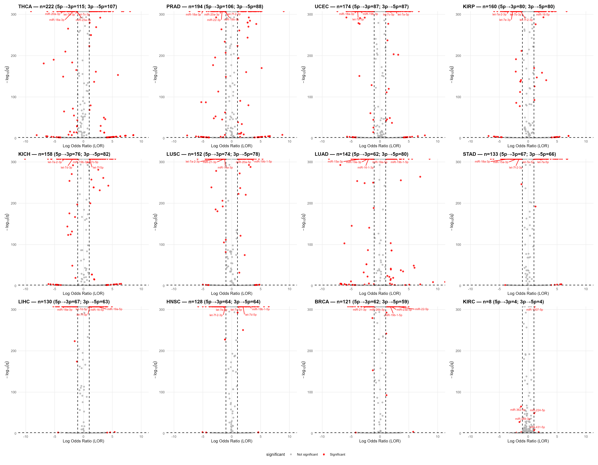
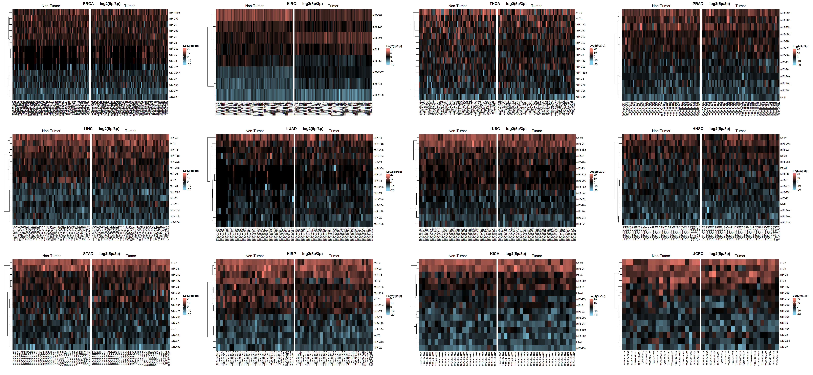
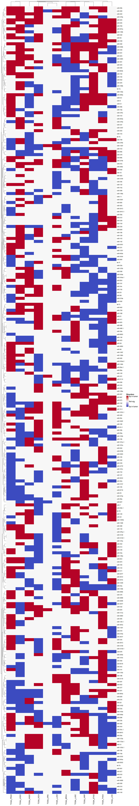

# TCGA Pan-Cancer miRNA Arm-Switching Pipeline

An automated, reproducible R pipeline for detecting miRNA arm usage bias across TCGA cancer cohorts. This repository extends the KIRC-focused analysis in [tcga-mirna-arm-switching](https://github.com/mahnoorrshahid/tcga-mirna-arm-switching) to a pan-cancer scale.

---

## Overview

Standard differential expression analysis treats miRNA abundance as a single value, but each miRNA precursor produces two mature strands, a 5p arm and a 3p arm, which target distinct gene networks. This pipeline detects **arm usage bias**: shifts in the relative dominance of 5p vs 3p arms between matched tumour and normal samples, using a log-odds ratio (LOR) framework with FDR correction.

The pipeline was applied to all 33 TCGA cancer cohorts. Of these, **12 cohorts** met the inclusion criterion of ≥ 20 matched tumour-normal pairs and were fully analyzed.

---

## Cancer types analyzed

| TCGA Code | Cancer Type | Matched Pairs |
|-----------|-------------|---------------|
| BRCA | Breast Invasive Carcinoma | 103 |
| HNSC | Head and Neck Squamous Cell Carcinoma | 43 |
| KICH | Kidney Chromophobe | 25 |
| KIRC | Kidney Renal Clear Cell Carcinoma | 71 |
| KIRP | Kidney Renal Papillary Cell Carcinoma | 34 |
| LIHC | Liver Hepatocellular Carcinoma | 49 |
| LUAD | Lung Adenocarcinoma | 46 |
| LUSC | Lung Squamous Cell Carcinoma | 45 |
| PRAD | Prostate Adenocarcinoma | 52 |
| STAD | Stomach Adenocarcinoma | 41 |
| THCA | Thyroid Carcinoma | 59 |
| UCEC | Uterine Corpus Endometrial Carcinoma | 21 |

---

## Methods

### Arm usage bias (LOR framework)

For each miRNA precursor, arm usage bias between tumour and normal was quantified using a log-odds ratio:

```
LOR = ln((T5p / T3p) / (N5p / N3p))
SD  = sqrt(1/T5p + 1/T3p + 1/N5p + 1/N3p)
Z   = LOR / SD
```

Two-sided p-values were derived from Z-scores and FDR-adjusted (Benjamini-Hochberg). A precursor was called arm-switched if **FDR < 0.01** and **|LOR| ≥ 1**, with a dominant arm flip between tumour and normal conditions.

### Differential expression

DESeq2 (v1.48.1) with paired design (`~ patient_id + condition`). Significance: **FDR < 0.05** and **|log2FC| ≥ 1**.

### Per-sample arm usage

Within-patient arm usage was computed as log2(5p+1 / 3p+1) per sample and visualized as side-by-side tumour/normal heatmaps for each cancer cohort.

### Annotation

Human miRNA GFF3 file: miRBase v22, GRCh38 (`hsa.gff3`), downloadable from [miRBase](https://www.mirbase.org/download/). It is not included in this repository.

---

## Key findings

- Significant arm-switching events ranged from **8 in KIRC to 222 in THCA**
- Most cancers showed balanced 5p/3p directionality; exceptions: LUAD (5p skew) and PRAD (3p skew)
- Several miRNA families recurred across ≥ 10 of 12 cancers:
  - **5p-biased families**: miR-374, miR-20, miR-200, miR-181
  - **3p-biased families**: miR-29, miR-26, miR-23, miR-92
  - **Mixed directionality**: miR-362, miR-19
- miR-374, miR-20, miR-200 each recurred in 11/12 cancers

---

## Figures

**Arm-switching volcano plots, 12 cancers** (log-odds ratio vs -log10 q; significant precursors in red)



**Per-sample log2(5p/3p) in matched normal and tumour tissue**



**Direction of arm switching for precursors shared across at least 3 cancers**



---

## Repository structure

```
scripts/softcode_final.R   Automated pan-cancer R pipeline
figures/                   Representative output figures
```

---

## Prerequisites

**Input data:** TCGA miRNA-seq raw count files and sample metadata, available via the [GDC Data Portal](https://portal.gdc.cancer.gov/) or downloadable with the [TCGAbiolinks](https://bioconductor.org/packages/release/bioc/html/TCGAbiolinks.html) R package. Organise one folder per cancer type under `data/` (e.g. `data/TCGA_KIRC/`), each containing a counts file matching `miRs_counts` and a sample sheet matching `miRs_samples`.

**R version:** 4.5.0  
**Key packages:** DESeq2 v1.48.1, ggplot2 v3.5.2, ComplexHeatmap, dplyr v1.1.4, tidyr v1.3.1, Bioconductor v3.21

---

## How to run

```r
# Folder containing data/<cohort>/ subfolders and hsa.gff3.txt
project_dir <- "path/to/miRNA_TCGA_project"
source("scripts/softcode_final.R")

# Run a single cancer cohort
run_arm_bias_pipeline("TCGA_KIRC")

# Run every cohort folder in data/ (skips cohorts with no matched pairs)
run_all_cancers()
```

Results are written to `results/<cohort>/`.

Each cancer cohort produces:
- DESeq2 volcano plot (top 15 labeled)
- Arm-switching volcano plot (LOR vs -log10 q)
- Paired tumour/normal heatmap of per-sample log2(5p/3p) for significant precursors
- Summary table of matched pair counts

---

## Related repository

The KIRC-specific analysis (including target prediction and KEGG enrichment for miR-369) is in [tcga-mirna-arm-switching](https://github.com/mahnoorrshahid/tcga-mirna-arm-switching).

---

## Citation / context

Developed as part of an MSc dissertation in Health Genomics (University of Essex, 2025), supervised by Dr Antonio Marco. Awarded the Molecular Medicine Prize.
